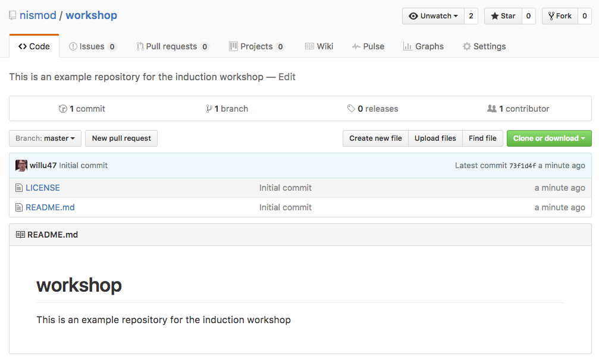
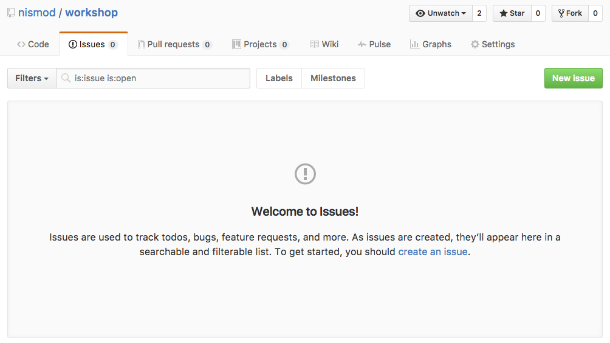
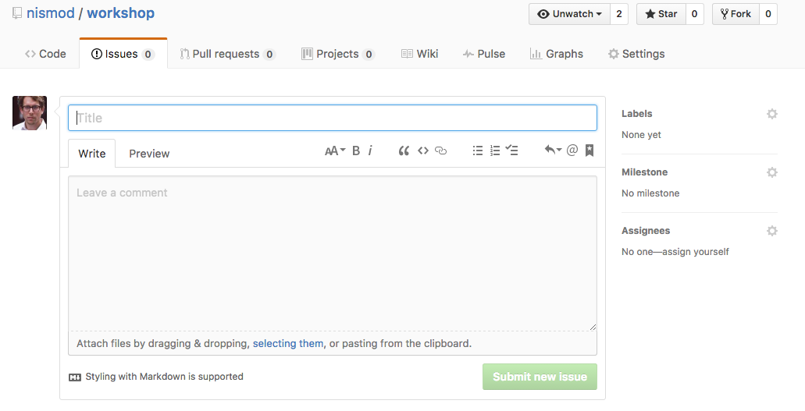

---
# 10. Communication

Questions:
- How do I communicate with other groups?
- How do I keep track of bugs and ideas?

Objectives:
- Explain the principle of issue tracking
- Introduce git flow, Slack and resources

Keypoints:
- Issues trackers help keep track of bugs and ideas
- Git flow is one way to organise multiple modellers who collaborate on a code base
---


???
---



---



---



???

- Useful descriptive title
- BUG: Steps required to recreate the problem
- FEATURE:

---

## Reference issues in commit messages

```bash
$ git commit -m "Fixes bug #25. Added float to variable"
```

---

## Practical: Use issues as part of a work flow

In Pairs:

1. Create an issue
1. Give it a descriptive title
1. Write the idea in the description
1. Add an appropriate tag
1. Assign it to a milestone or project
1. Assign the issue to your colleague
1. Implement the idea
1. Add a reference to the issue in a commit message
1. Submit a pull request

---

## Feedback

- Alternative positive and negative feedback
- What should we cover next?
